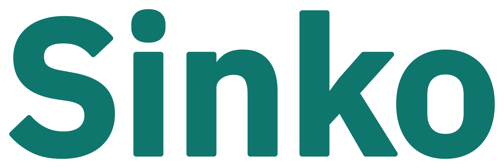
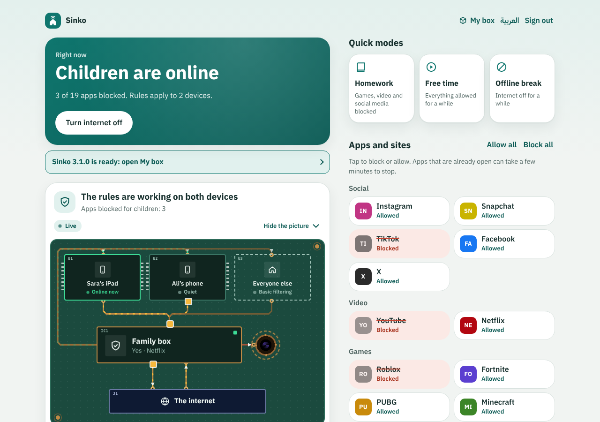
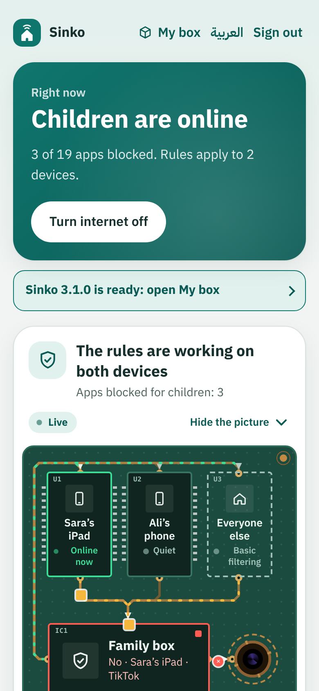
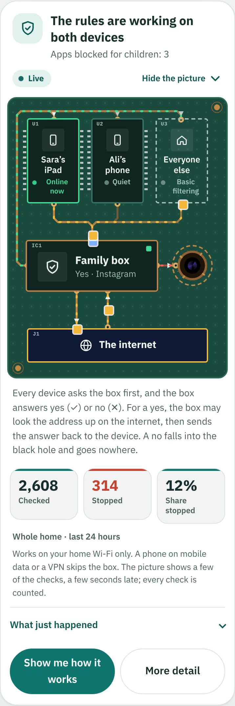
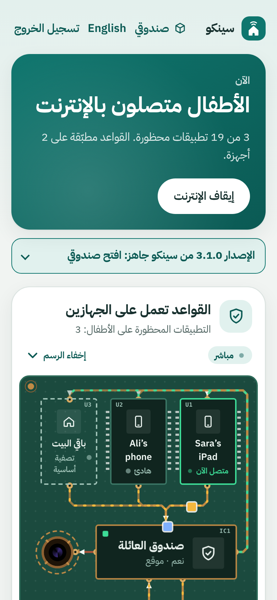
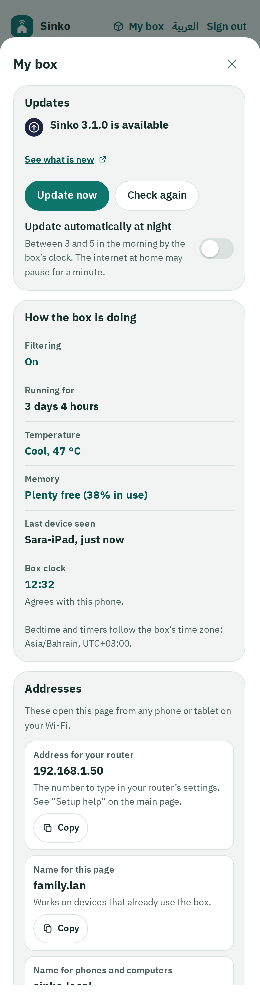
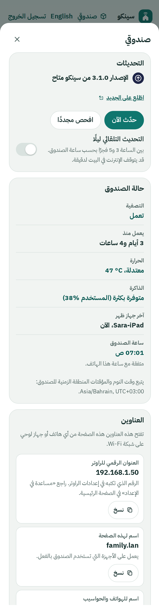

<p align="center">
  
</p>

<p align="center"><strong>Calm internet for the family.</strong><br>
<span dir="rtl" lang="ar"><strong>إنترنت هادئ للعائلة</strong></span><br>
Parental controls that live on a small box in your home, in Arabic and English.<br>
<a href="https://iret33.github.io/sinko/">Website</a> · <a href="docs/install.md">Install</a> · <a href="docs/faq.md">FAQ</a> · <a href="docs/privacy.md">Privacy · الخصوصية</a></p>

<p align="center">
  <a href="https://github.com/iret33/sinko/releases"></a>
  <a href="https://github.com/iret33/sinko/releases/latest"></a>
  <a href="https://github.com/iret33/sinko/releases/latest"></a>
  <a href="https://github.com/iret33/sinko/stargazers"></a>
</p>
<p align="center">
  <a href="https://github.com/iret33/sinko/actions/workflows/ci.yml"></a>
  <a href="https://github.com/iret33/sinko/commits/master"></a>
  <a href="COPYING.md"></a>
  
  
  
  <a href="CONTRIBUTING.md"></a>
</p>
<!-- Add this badge once the counter service is deployed (telemetry/README.md), with your own address:
<a href="docs/privacy.md"></a> -->

<p align="center">
  
</p>

<p align="center">
  
  &nbsp;
  
  &nbsp;
  
</p>

<details align="center"><summary><b>My box</b>: updates, health and addresses (tap to see)</summary>
<p align="center">
&nbsp;</p>
</details>

Sinko is a simple page for parents, on top of [Pi-hole](https://pi-hole.net) v6. Every phone, tablet and console at home
asks a small box in your house "where is this app?" first, and the box says yes or no. From your phone you can:

- **block or allow apps** (YouTube, TikTok, Roblox, Instagram, Snapchat, …) with one tap;
- switch on **Homework** mode, a timed **Free time**, or a timed **Offline break**;
- **pause** one child's device;
- set a **Bedtime** that turns the internet off at night and back on in the morning;
- watch **the live picture**: what the box is checking and stopping, in words a parent can follow;
- look after the box from the same page (**My box**): update it, see its health, change the password, back up, restart.

Timers and bedtime run on the box itself, so they keep working after you close the page. Nothing needs a computer
after the first set-up.

## See it work

<p align="center">
  
</p>

Every app first asks the box "where is this?". If your rules allow it, the box asks the internet and passes the answer back. If
not, the box says no and the app simply does not open. The **live picture** in the page shows these answers as they happen.

## Two ways to get Sinko

**Ready-made.** An Orange Pi Zero 3 with Sinko already on its card: plug in the cable and the power, open
`http://sinko.local` on your phone, choose a password, point your router at the box. **Ready-made boxes are not on sale
yet.** Follow the project on GitHub for news; the [project website](https://iret33.github.io/sinko/) will say where to buy
one as soon as there is a shop.

**Build your own, free.** Any small Debian-based computer will do (an Orange Pi Zero 3 or a Raspberry Pi is ideal), and it
takes one command: see [Install](#install) below.

Sinko is free software (GPL-3.0-or-later). Anyone may build, share and sell help with it; flashed boxes sold under the
Sinko name are covered by [`TRADEMARK.md`](TRADEMARK.md), and [`docs/selling.md`](docs/selling.md) explains what a seller owes
the software's authors.

## Install

For people who build their own box. You need a small computer that runs Debian, Ubuntu or Raspberry Pi OS (an Orange Pi
Zero 3 is what Sinko is tested on), connected to the router by an Ethernet cable, with more than 1 GB of free disk space.
On it, over SSH or at its keyboard, run one command:

```bash
curl --proto '=https' --proto-redir '=https' -fsSL https://github.com/iret33/sinko/releases/latest/download/install.sh | sudo bash
```

It installs Pi-hole v6 if needed, Sinko, the services and the block lists, asks you for a parent password, and tells you the
address of the page and the one setting to change in your router (the DNS server: the box's address, reserved for the box).
Then open the page on your phone and add your children's devices. Running the command again updates Sinko and keeps your
password, devices and rules. Everything about it (options, the Orange Pi Zero 3 steps, keeping the box safe, removing
Sinko) is in [`docs/install.md`](docs/install.md).

## Updates

Open **My box**: it says when a newer version exists, and **Update now** installs it, checks that it works and
**puts the previous version back by itself if it does not**. An update never touches your password, devices, rules,
timers or bedtime. There is an option to update automatically at night. Details and the protections:
[`docs/updating.md`](docs/updating.md).

## Privacy, plainly

Sinko keeps your children's names and devices, your rules and your settings on the box, and never sends them to the project
or to anyone else. There is no account and no tracking. Three things you should know:

- Like every DNS filter, Pi-hole passes on the **names of sites it cannot answer itself** to an upstream DNS service
  (Cloudflare for Families, by default, on a box Sinko sets up). It sees those names and your home's internet address. The
  project never receives them. You can choose another service in Pi-hole's settings.
- To look for a new version, to update and to refresh its block lists, the box asks **GitHub**, which sees the box's
  internet address (as any website you visit does). Nothing about your family is in those requests.
- An optional **anonymous counter** (how many Sinko boxes are online) is **off until you say yes**; it sends a random number,
  the version and the kind of board, and nothing else. Switching it off makes the box ask the counter to forget it.

The whole statement, in English and Arabic, with exactly what is sent and when: [`docs/privacy.md`](docs/privacy.md).

## What it cannot do

DNS filtering is a strong everyday filter, not a lock:

- A device on **mobile data**, or using a **VPN** app, does not use the box.
- Apps that connect to fixed IP addresses (Telegram does this in part) may keep working after being blocked.
- Apps that are already open can take a few minutes to stop, until the device's own DNS cache expires.
- A child who knows the main Wi-Fi password and can change network settings can get around it.

Use it together with Screen Time (iPhone) or Family Link (Android). More in the [FAQ](docs/faq.md).

## Documentation

| | |
|---|---|
| [`docs/install.md`](docs/install.md) | Install, options, Orange Pi Zero 3, router step, commands, removing |
| [`docs/updating.md`](docs/updating.md) | Updates, rollback, pinning a version |
| [`docs/troubleshooting.md`](docs/troubleshooting.md) | An app still works? Cannot open the page? Forgot the password? |
| [`docs/faq.md`](docs/faq.md) | Questions and answers |
| [`docs/privacy.md`](docs/privacy.md) | What is sent, where, and how to turn it off (English and Arabic) |
| [`docs/how-it-works.md`](docs/how-it-works.md) | Pi-hole groups, the live picture, the block lists, files on the box |
| [`docs/product-image.md`](docs/product-image.md), [`docs/selling.md`](docs/selling.md) | Making and selling ready-made boxes |
| [`docs/hardware-test-checklist.md`](docs/hardware-test-checklist.md) | What to test on a real box before a release or a sale |
| [`docs/maintainers/`](docs/maintainers) | Architecture and contracts; releasing |
| [`CONTRIBUTING.md`](CONTRIBUTING.md), [`SECURITY.md`](SECURITY.md), [`CHANGELOG.md`](CHANGELOG.md) | Helping, reporting a vulnerability, what changed |

## Development

```bash
python3 -m unittest discover -s tests -p "test_*.py"    # box program, updater, lists, doctor, diagnose, copy, release build; with playwright also the real page against the real scheduler
node --test tests/*.test.js                              # the page's logic (state, live picture, My box)
sudo bash tests/run_shell_tests.sh                       # installer, migration, seal, first start (stubbed system)
python3 tests/ui_smoke.py --shots /tmp/shots             # the page in a real browser, English and Arabic (needs playwright)
python3 tests/mock_pihole.py --web web --setup --live    # the page at http://127.0.0.1:8080, password "test", with demo traffic
```

`tests/mock_pihole.py` imitates the parts of the Pi-hole v6 API Sinko uses, so no device is needed. Full list and the
pull-request checklist: [`CONTRIBUTING.md`](CONTRIBUTING.md).

## Licences and names

- Sinko's code is **GPL-3.0-or-later** ([`LICENSE`](LICENSE), [`COPYING.md`](COPYING.md)); the block lists in `lists/` are
  public domain (CC0); the bundled font, IBM Plex Sans Arabic, is under the SIL Open Font License (`web/fonts/OFL.txt`).
- "Sinko" and its logo are the project's marks ([`TRADEMARK.md`](TRADEMARK.md)). Third-party software and trademarks are
  listed in [`NOTICE`](NOTICE).
- Pi-hole is a registered trademark of Pi-hole LLC and is licensed under the EUPL-1.2. Sinko is independent software that
  works with it, and is not affiliated with, endorsed by or supported by Pi-hole LLC.
